# Astro Starter Kit: Basics

```sh
npm create astro@latest -- --template basics
```

[](https://stackblitz.com/github/withastro/astro/tree/latest/examples/basics)
[](https://codesandbox.io/p/sandbox/github/withastro/astro/tree/latest/examples/basics)
[](https://codespaces.new/withastro/astro?devcontainer_path=.devcontainer/basics/devcontainer.json)

> 🧑‍🚀 **Seasoned astronaut?** Delete this file. Have fun!


## 🚀 Project Structure

Inside of your Astro project, you'll see the following folders and files:

```text
/
├── public/
│   └── favicon.svg
├── src/
│   ├── components/
│   │   └── Card.astro
│   ├── layouts/
│   │   └── Layout.astro
│   └── pages/
│       └── index.astro
└── package.json
```

Astro looks for `.astro` or `.md` files in the `src/pages/` directory. Each page
is exposed as a route based on its file name.

There's nothing special about `src/components/`, but that's where we like to put
any Astro/React/Vue/Svelte/Preact components.

Any static assets, like images, can be placed in the `public/` directory.

## 🧞 Commands

All commands are run from the root of the project, from a terminal:

| Command                   | Action                                           |
| :------------------------ | :----------------------------------------------- |
| `npm install`             | Installs dependencies                            |
| `npm run dev`             | Starts local dev server at `localhost:4321`      |
| `npm run build`           | Build your production site to `./dist/`          |
| `npm run preview`         | Preview your build locally, before deploying     |
| `npm run astro ...`       | Run CLI commands like `astro add`, `astro check` |
| `npm run astro -- --help` | Get help using the Astro CLI                     |

## 👀 Want to learn more?

Feel free to check [our documentation](https://docs.astro.build) or jump into
our [Discord server](https://astro.build/chat).

```mermaid
gantt
    title susuru イベントスケジュール
    dateFormat YYYY-MM-DD
    section 準備
        動画企画立案 : task_plan, 2025-01-30, 1d
        店舗情報収集 : task_store_info, after task_plan, 1d
        撮影機材準備 : task_equipment_prep, after task_store_info, 1d
        小道具準備 : task_props_prep, after task_equipment_prep, 1d
        シナリオ作成 : task_scenario, after task_props_prep, 1d
        関係者連絡調整 : task_contact, after task_scenario, 1d
        衣装準備 : task_costume, after task_contact, 1d
        移動手段確保 : task_transport, after task_costume, 1d
        スケジュール最終確認 : task_schedule_check, after task_transport, 1d
    section イベント当日準備
        撮影機材最終チェック : task_equipment_final_check, 2025-01-31, 1h
        小道具最終確認 : task_props_final_check, after task_equipment_final_check, 30m
        衣装着用 : task_costume_wear, after task_props_final_check, 30m
    section イベント開催 (撮影)
        店舗へ移動 : task_move_store, 2025-01-31, 1h
        着席 : task_seat, after task_move_store, 15m
        水垢コップ発見・大声 : task_water_cup_shout, after task_seat, 5m
        店主登場・チャーシューサービス : task_owner_charshu_service, after task_water_cup_shout, 5m
        自己紹介・脅迫 : task_intro_threat, after task_owner_charshu_service, 3m
        スープレビュー : task_soup_review, after task_intro_threat, 5m
        虫発見・調味料倒し : task_bug_sauce_down, after task_soup_review, 5m
        店主再登場・チャーシュー丼 : task_owner_charshu_don, after task_bug_sauce_down, 5m
        麺レビュー : task_noodle_review, after task_owner_charshu_don, 5m
        髪の毛発見・厨房へ : task_hair_kitchen, after task_noodle_review, 5m
        店主土下座撮影 (サブチャンネル) : task_owner_dogeza, after task_hair_kitchen, 10m
        ラーメン完食 (任意) : task_ramen_finish, after task_owner_dogeza, 15m
        撮影機材撤収 : task_equipment_remove, after task_ramen_finish, 30m
        店舗への挨拶・支払い : task_store_greet_pay, after task_equipment_remove, 15m
    section イベント終了後 (片付け)
        撮影データ整理 : task_data_organize, 2025-01-31, 1h
        動画編集 (本チャンネル) : task_video_edit_main, after task_data_organize, 3h
        動画編集 (サブチャンネル) : task_video_edit_sub, after task_video_edit_main, 2h
        サムネイル作成 (本チャンネル) : task_thumbnail_main, after task_video_edit_sub, 1h
        サムネイル作成 (サブチャンネル) : task_thumbnail_sub, after task_thumbnail_main, 30m
        動画アップロード (本チャンネル) : task_upload_main, after task_thumbnail_sub, 1h
        動画アップロード (サブチャンネル) : task_upload_sub, after task_upload_main, 30m
        SNS告知 : task_sns_announce, after task_upload_sub, 30m
        関係者への報告 : task_report_related, after task_sns_announce, 30m
        後片付け : task_cleanup, after task_report_related, 1h
        反省会 (任意) : task_reflection, after task_cleanup, 1h
```


